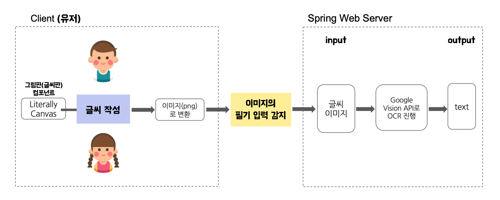

# doranteacher-backend
CAU CapstoneDesign(2) Class01 Team4 Project "doran-teacher" - frontend repository

    

## 🎥 Live Service

- **Live Service**
    - [Go](https://doranssam.com/)
- Live Demo youtube
    - [Go](https://www.youtube.com/watch?v=GzYts7R1SD4)

## Core feature
### 글씨판 필기체 텍스트화

### 일기 유형 추천

## ✈️ Tech stacks

- Java11 
- Spring
- AWS Cloud
- JWT token authentication
- JPA
- MySQL
